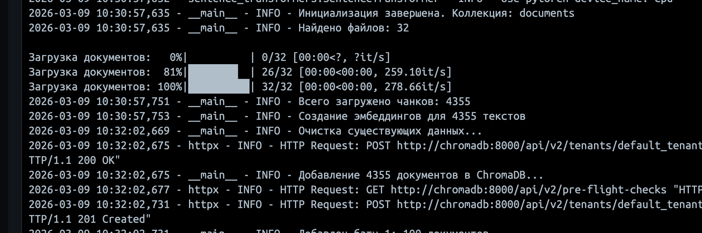

Используемая модель эмбендинга:
- all-MiniLM-L6-v2
Используемая база данных:
- ChromaDB
Сколько чанков в индексе:
 - до 100 чанков в индексе
 - Всего документов: 32
 - Всего чанков: 4355
Сколько времени заняла генерация:
 - до 2 минут


чтобы посмотреть результат индексации
1) можно запустить 
```
docker compose up
```

2) Дождаться, когда выполнится все построение и подсчеты
3) Зайти по адресу 
```
http://localhost:8001
```
4) В качестве строки соединения использовать 
```
http://chromadb:8000
```

5) Посмотреть результат

