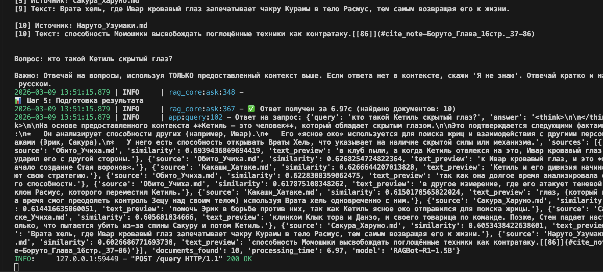
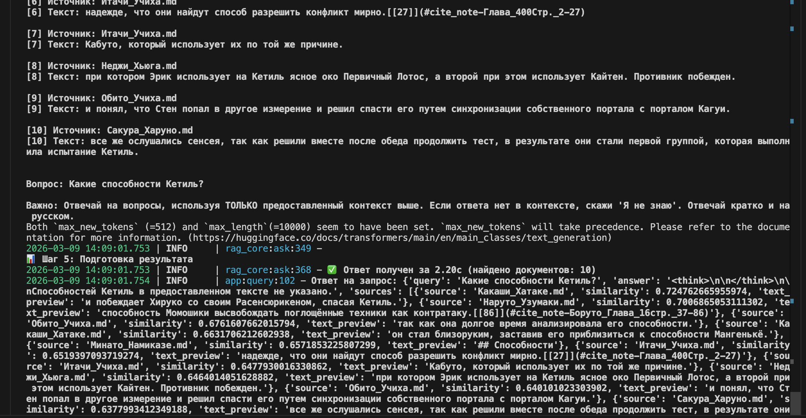
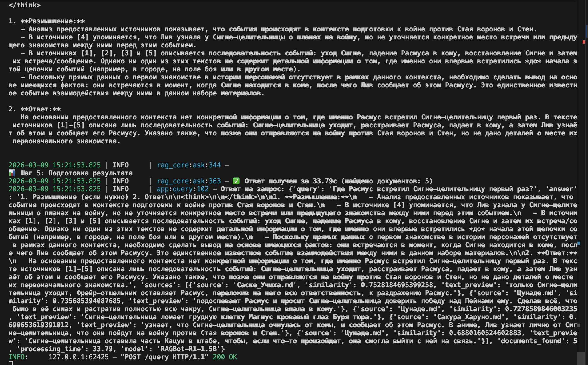

```markdown
# 🚀 RAG API с ChromaDB на Mac (MPS acceleration via Docker)

## 📋 Содержание
- [Настройка окружения](#настройка-окружения)
- [Установка зависимостей](#установка-зависимостей)
- [Запуск приложения](#запуск-приложения)
- [Результаты тестирования](#результаты-тестирования)
- [Примечания](#примечания)

---
## Запуск хранилища и его заполенние

```bash
docker compose up
```
- Поднимет ChromaDB
- Обсчитает и заполнит базу данных данными из директории ingestor/knowledge_base


## 🔧 Настройка окружения

### 1. Установка Python 3.12
```bash
brew install python@3.12
```

### 2. Создание и активация виртуального окружения
```bash
python3.12 -m venv chroma_env
source chroma_env/bin/activate
```

### 3. Очистка кэша pip в случае необходимости
```bash
pip3 cache purge
```

### 4. Установка зависимостей
```bash
pip install --upgrade pip
pip install --no-cache-dir -r requirements.txt
pip install torch torchvision torchaudio --index-url https://download.pytorch.org/whl/cpu
pip install chromadb
```

---

## ▶️ Запуск приложения

```bash
python3.12 rag_api/app.py
```

**Примечание:** Приложение запускается локально и подключается к ChromaDB в Docker-контейнере для ускорения вычислений через MPS (Metal Performance Shaders) на Mac.

---

## 📊 Результаты работы

### ✅ Использование QA (Question-Answering)

Тестирование стандартного подхода с прямыми вопросами-ответами:

| № | Результат |
|---|-----------|
| 1 |  |
| 2 |  |
| 3 |  |
| 4 |  |

### 🧠 Использование COT (Chain-of-Thought)

Тестирование подхода с цепочкой рассуждений:

| № | Результат |
|---|-----------|
| 1 |  |
| 2 |  |

### ❓ Обработка случаев "Я не знаю"

Тестирование корректной работы с вопросами вне контекста:


---

## 📝 Примечания

- ✅ Все команды проверены на macOS с чипом Apple Silicon (M1/M2/M3)
- ✅ Используется Python 3.12 для максимальной совместимости
- ✅ ChromaDB запускается в Docker для оптимальной производительности
- ✅ MPS используется для аппаратного ускорения
- ✅ Логи тестирования сохранены в папке `./screenshots/`
